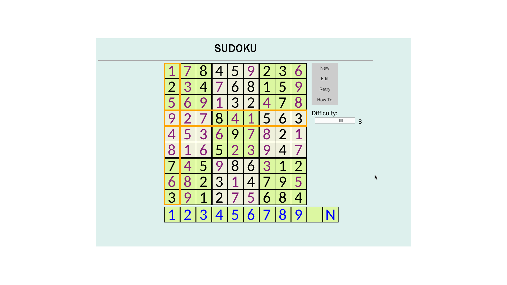

# 
数独实验报告

## 实验要求
实现一个带图形界面的数独游戏

## 实验环境
Linux debian 4.9.0-1-amd64 #1 SMP Debian 4.9.6-3 (2017-01-28) x86_64 GNU/Linux

## 实验工具
gcc version 6.3.0 20170205 (Debian 6.3.0-6)
Glasgow Haskell Compiler, Version 8.0.1, stage 2 booted by GHC version 8.0.1
Mozilla Firefox 45.7.0

## 实现思路
将此程序划分为三部分：求解与生成数独的程序、用网页实现的用户界面、简易的服务器。

## 具体实现
### 用户界面
使用html和javascript编写，在用户填入数字时动态地检查错误，产生新数独、求解数独时向服务器发送请求，接收和处理服务器的响应信息。使用ajax来与服务器通信。

### 服务器
使用Haskell编写，启动后监听主机的特定端口（目前的设定为61234），收到请求后fork自身（因此可以同时处理多个请求）并根据请求内容发送网页、生成数独、求解数独。

### 数独求解
使用C语言编写，用DLX算法高效地求解数独。关于相关算法的说明见下面两个链接：[algorithm X](https://en.wikipedia.org/wiki/Knuth's_Algorithm_X)，[dancing links](https://en.wikipedia.org/wiki/Dancing_Links)。
最终会返回给定数独的答案（或无解）、是否是唯一解。

### 数独生成
使用C语言编写，生成算法见“遇到的困难和解决方案”中“数独的生成”。

## 遇到的困难和解决方案
### 数独的生成
最初的实现是根据难度要求计算需要空出的格子数目（即假设空格越多难度越大），生成一个完整的数独，挖去这个数目的格子并检验解是否唯一，如果唯一则将其作为题目，否则重新挖格子。事实上这样生成的数独难度往往不大。因此我对挖去格子的方法做了改进：
> 1. 生成一个完整的数独
> 2. 确定要挖去的格子数目
> 3. 随机挖去一个格子
> 4. 0.75的概率从已经挖去的格子中任选一个， 挖去与它相关联（同一行、同一列或同一宫）的一个格子
  0.25的概率随机挖去一个格子
> 5. 重复4直到产生足够多的空格

经过这样的改进，生成的数独难度相比以前有所提高。

### 服务器与生成、求解程序的通讯
服务器与生成数独、求解数独的程序是相互独立的，因此需要一些方法来支持它们相互之间交换信息。最初的实现方案是建立临时文件，需要的信息都写入文件中、从文件中读取，但这样在多个请求同时发起时就会出现竞争现象，要避免这个问题只能使服务器退化成单线程的。后来了解到Haskell提供了一个叫做readCreateProcess的函数，可以指定对被调用程序的输入并且读取它的输出，于是服务器愉快地回到了多线程模式。

### 释放socket
服务器程序在用户按下ctrl+c时退出，但退出后短时间内再次启动很可能出现“sudoku_server: bind: resource busy (Address already in use)
”提示，无法启动。原因是程序退出后其占用的socket不会立即被操作系统释放，再次启动时无法获取相应的socket。设置处理sigINT的handler来主动释放socket即可。

## 最终实现的功能
* 机器出题玩家解题
* 玩家出题机器解题并判断是否多解
* 多人同时进行游戏
* 即时判错
* 笔记功能

## 编译和使用方法
这一实现只支持类unix系统。确保本机安装了gcc和ghc，在src文件夹下执行make命令，然后进入生成的release文件夹，执行sudoku_server，再打开浏览器，访问“本机ip:61234”即可进行游戏。使用键盘的w、a、s、d键或鼠标来选择方格，用数字键或屏幕上的数字按钮输入数字、清除方格。使用'.'可以开启或关闭笔记功能。

## 效果图

